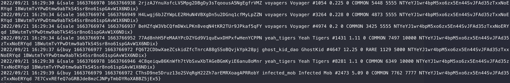

# MagicEden on-chain sniper

## Quickstart

---

1. Clone repository
2. Create .env file and fill in one variable:
    
    NODE_ENDPOINT=<YOUR_SOLANA_RPC_ENDPOINT>
    
    You can get it for free at https://www.quicknode.com

3. go run cmd/main.go

Currently the sniper is using [parsed tokens](./data/collections.json) ([list of all collections](./collections.txt))

## Example of usage

---

Logs contain:
* Action type (now only buy/sell)
* Block/Current timestamp
* collection symbol, token name
* price, rarity, rank, supply, seller, buyer

